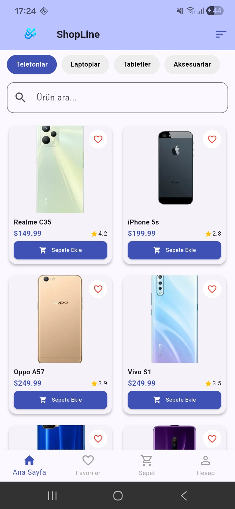
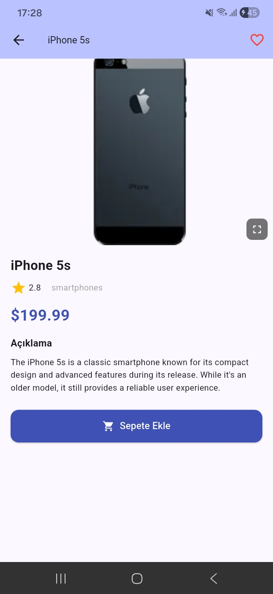
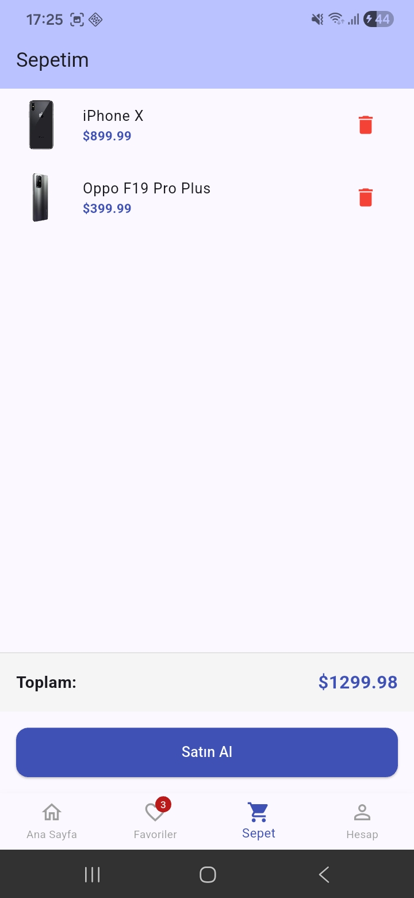
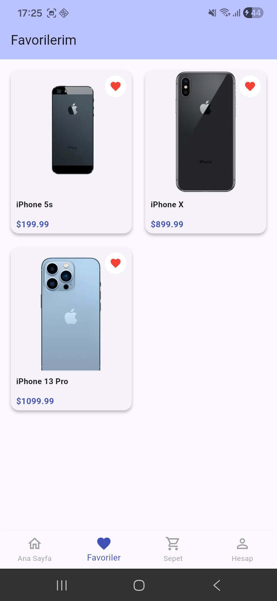
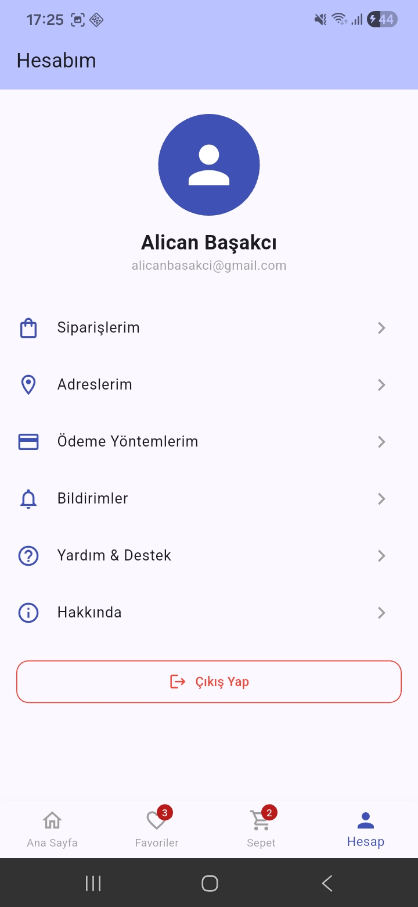

# ShopLine - Mini Katalog Uygulaması

ShopLine, Flutter ile geliştirilmiş modern bir e-ticaret katalog uygulamasıdır.
DummyJSON API'si kullanılarak gerçek ürün verileri çekilmekte ve kullanıcıya
şık bir arayüzle sunulmaktadır.

---

## Ekran Görüntüleri

| Ana Sayfa | Ürün Detayı | Sepet | Favoriler |
|-----------|-------------|-------|-----------|
|  |  |  |  | 

---

## Özellikler

- Kategoriye göre ürün listeleme (Telefon, Laptop, Tablet, Aksesuar)
- Ürün arama ve filtreleme
- Fiyat ve isme göre sıralama (artan/azalan)
- Ürün detay sayfası
- Resme tıklayınca tam ekran görüntüleme ve zoom
- Sepete ürün ekleme / çıkarma ve toplam fiyat hesaplama
- Favori ürünlere ekleme
- Alt navigasyon menüsü (Ana Sayfa, Favoriler, Sepet, Hesap)
- Animasyonlu splash screen
- Responsive tasarım (telefon ve tablet uyumlu)

---

## Kullanılan Teknolojiler

- Flutter 3.35.5
- Dart
- http paketi
- DummyJSON API (https://dummyjson.com)

---

## Kurulum ve Çalıştırma

1. Repoyu klonla:
git clone https://github.com/alicanbasakci/ShopLine.git

2. Proje klasörüne gir:
cd ShopLine

3. Bağımlılıkları yükle:
flutter pub get

4. Uygulamayı çalıştır:
flutter run

---

## Proje Klasör Yapısı
lib/
├── main.dart
├── models/
│   └── product.dart
├── screens/
│   ├── splash_screen.dart
│   ├── main_screen.dart
│   ├── home_screen.dart
│   ├── detail_screen.dart
│   ├── cart_screen.dart
│   ├── favorites_screen.dart
│   └── account_screen.dart
└── widgets/
└── product_card.dart

---

## Geliştirici

- **Ad:** Alican Başakcı
- **Eğitim:** Mobil Uygulama Geliştirme; Android / iOS
